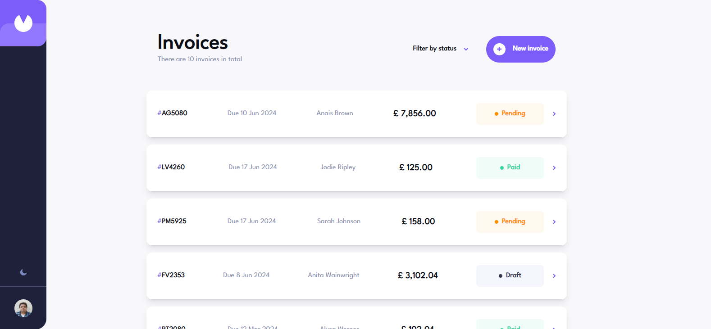
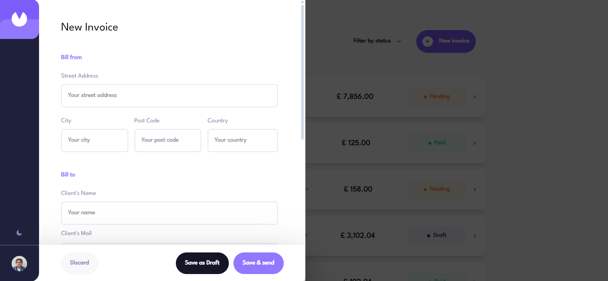
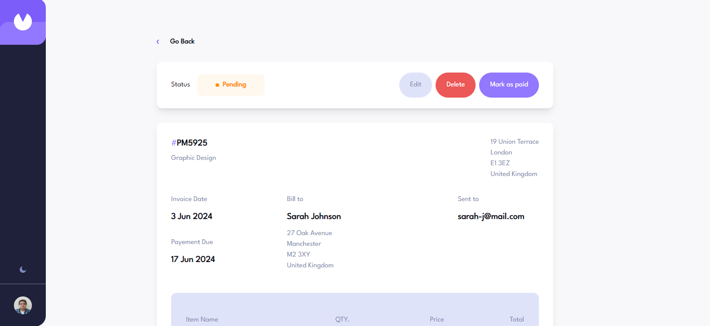
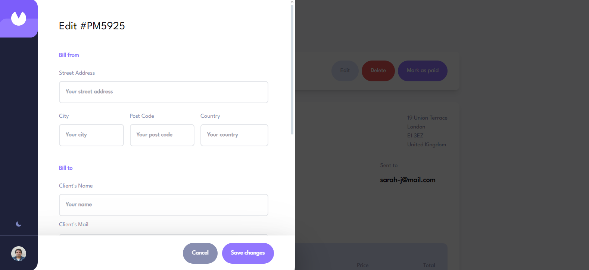
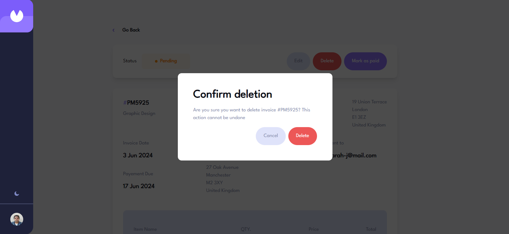
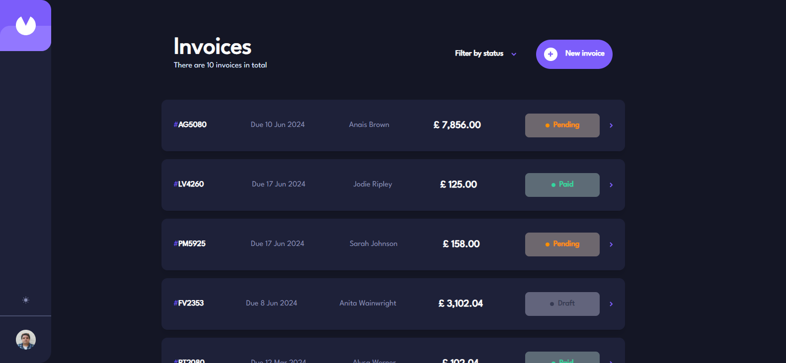

# Invoice App

🚧 Please note that the application is currently under development and is only available locally. To run it on your computer, please refer [here](https://github.com/CalcagnoLoic/invoice-app-server?tab=readme-ov-file#launching-backend--docker-compose) for backend installation. Thank you for your understanding.🚧

<p align="center">
  <a href="https://skillicons.dev">
    
  </a>
</p>

In this application, users are able to view all invoices and their status. They can also add, delete or edit invoices already in the database.

<p align="center">
  
</p>

| An user can create a new invoice | An user can see the detail of these invoices |
| -------------------------------- | -------------------------------------------- |
|   |             |

| An user can update an existed invoice | An user can delete an existed invoice |
| ------------------------------------- | ------------------------------------- |
|    |      |

| Light Mode                        | Dark Mode                           |
| --------------------------------- | ----------------------------------- |
|  |  |

## Launching frontend server

To start the project locally, please clone it and root it before starting these lines.

```cmd
npm run i
npm run dev
```

## User stories

Your users should be able to:

- [ ] Create, read, update, and delete invoices <kbd>In Progress</kbd>
- [ ] Receive form validations when trying to create/edit an invoice <kbd>In Progress</kbd>
- [ ] Save draft invoices, and mark pending invoices as paid
- [x] Filter invoices by status (draft/pending/paid)
- [x] Toggle light and dark mode
- [x] View the optimal layout for the app depending on their device's screen size
- [x] See hover states for all interactive elements on the page
- [x] Bonus: Build this project as a full-stack application

## Built with

- Semantic HTML5 markup
- Mobile-first workflow
- TailwindCSS
- React
- TypeScript
- Storybook
- Formik
- CICD workflow
- Vitest

## Author

- Personnal website - [Portfolio](https://calcagno-loic.netlify.app/)
- Frontend Mentor - [@CalcagnoLoic](https://www.frontendmentor.io/profile/CalcagnoLoic)
- Linkedin - [LinkedIn](https://www.linkedin.com/in/loic-calcagno/)
